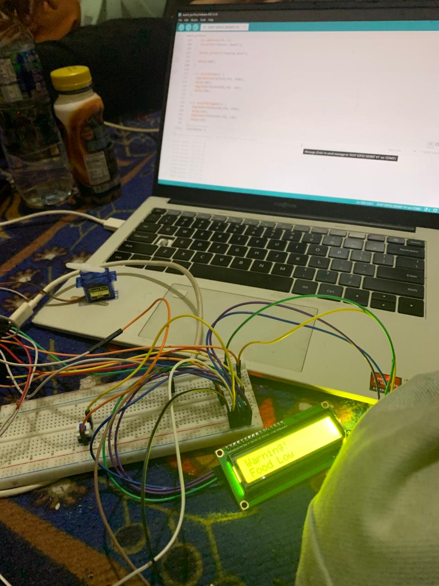
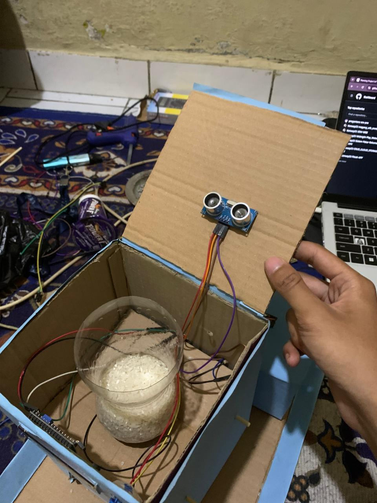
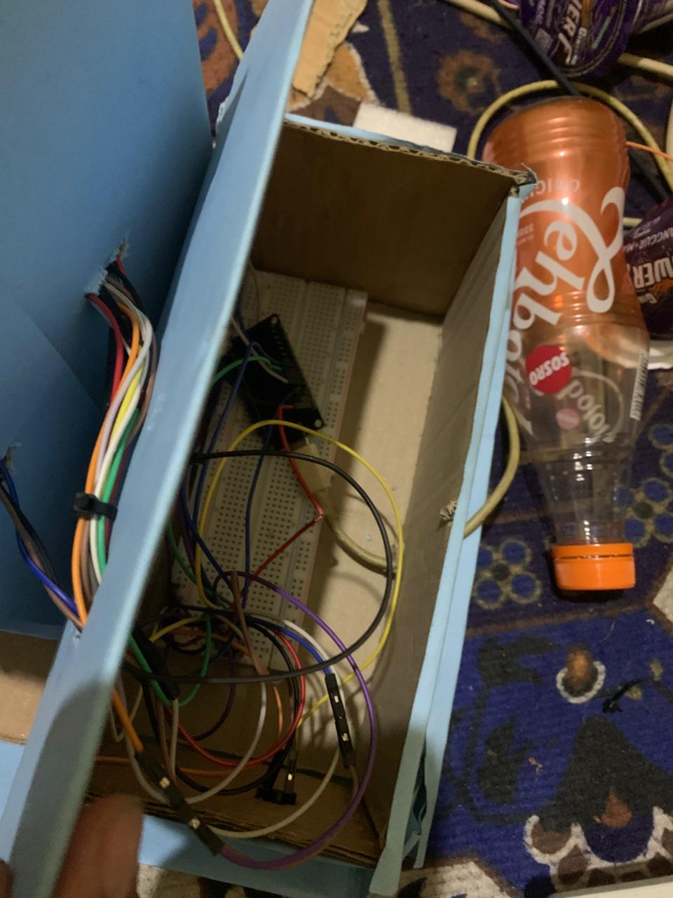

# IoT Pet Feeder & Drinker

Project ini adalah perencanaan awal untuk membuat sistem pemberi makan dan minum hewan peliharaan secara otomatis berbasis IoT. Pada tahap ini, project masih berfokus pada konsep, tujuan, latar belakang, dan arah pengembangan sistem.

Project ini dalam pengembangan. Komponen hardware, serta kebutuhan-kebutuhan untuk project ini telah ditentukan.

---

## List Anggota Kelompok 2
1. Rifki Muhamad Fauzi - 23552011078
2. Nisa Silva Triana - 23552011094
3. Adrianto - 23552011381

---

## Status Project

Final

---

## Link Penting

Kode ESP32: [Link ke branch ESP32](https://github.com/Kenway23/Kelompok-2_Pet-Feeder-Drinker-IoT/tree/esp32) \n
Wokwi : [Link ke prototype Wokwi](https://wokwi.com/projects/465871190871984129)

---

## Gambar Simulasi Project
## V1

## V2

## V3

## Deskripsi Project

IoT Pet Feeder & Drinker adalah ide project yang bertujuan untuk membantu pemilik hewan peliharaan dalam memberikan makanan dan minuman secara lebih teratur, praktis, dan efisien.

Sistem ini direncanakan dapat membantu pengguna dalam mengatur proses pemberian makan dan minum hewan, baik secara otomatis maupun melalui kontrol tertentu yang akan ditentukan pada tahap pengembangan berikutnya.

Pada tahap awal, project ini belum berfokus pada detail teknis seperti komponen mikrokontroller, sensor, aplikasi mobile, web dashboard, database, atau platform IoT. Fokus utama project saat ini adalah menyusun gambaran umum sistem agar arah pengembangan menjadi lebih jelas.

---

## Latar Belakang

Hewan peliharaan membutuhkan makanan dan minuman secara teratur agar tetap sehat. Namun, pemilik hewan terkadang memiliki aktivitas yang padat sehingga pemberian makan atau minum dapat terlambat.

Permasalahan tersebut dapat dibantu dengan pemanfaatan teknologi otomatisasi dan Internet of Things. Dengan adanya sistem pemberi makan dan minum otomatis, pemilik hewan dapat lebih mudah memastikan kebutuhan dasar hewan tetap terpenuhi.

Project ini dirancang sebagai solusi awal untuk membuat alat yang dapat membantu proses pemberian makan dan minum hewan peliharaan secara lebih terjadwal dan praktis.

---

## Tujuan Project

Tujuan dari project ini adalah:

1. Merancang sistem pemberi makan dan minum hewan peliharaan otomatis.
2. Membantu pemilik hewan agar lebih mudah mengatur jadwal pemberian makan dan minum.
3. Mengurangi risiko hewan terlambat mendapatkan makanan atau minuman.

---

## Rumusan Masalah

Beberapa permasalahan yang ingin diselesaikan melalui project ini adalah:

1. Bagaimana cara membantu pemilik hewan dalam memberi makan dan minum secara lebih teratur?
2. Bagaimana membuat konsep alat yang dapat bekerja secara otomatis?
3. Bagaimana sistem dapat membantu mengurangi ketergantungan pada pemberian makan secara manual?

---

## Manfaat Project

Manfaat yang diharapkan dari project ini adalah:

1. Membantu pemilik hewan dalam mengatur pemberian makan dan minum.
2. Membantu hewan mendapatkan makanan dan minuman secara lebih teratur.
3. Menjadi latihan penerapan konsep IoT dalam kehidupan sehari-hari.
4. Menjadi dasar pembelajaran tentang otomatisasi sederhana.
5. Menjadi pondasi untuk pengembangan sistem berbasis mikrokontroller, aplikasi, dan database.

---

## Komponen yang digunakan
1. ESP32 : Otak dari alat
2. LCD 12IC: Untuk menampilkan indikator
3. Servo: Gerbang untuk mengeluarkan pakan
4. Buzzer: Untuk memberikan sinyal suara
5. Sensor ultrasonik: Untuk mendeteksi pakan jika sudah habis
6. Button: Untuk mengeluarkan pakan secara manual / menjalankan alat secara manual
7. Breadboard: Untuk merapikan perkabelan dan memperbanyak jalur
8. Kabel Jumper

## Dokumentasi Foto
## Screenshot Website

---

## Proses Wiring

---

## Final Wiring
|  | 

---

## Demo Project
|  | 

